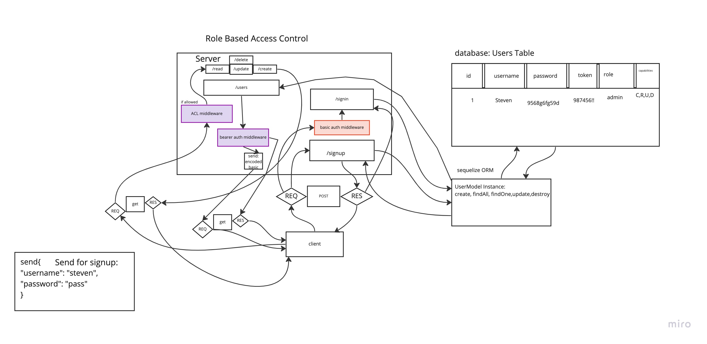

# LAB - Class 08

## Project: Auth-Api

### Author: Steven Rejdukowski

### Problem Domain

Combine these 2 servers into a single server

&

Create a new set of “Protected” API routes
  

### Links and Resources

- [ci/cd](https://github.com/stevenrej/auth-api/actions) (GitHub Actions)
- [prod deployment](https://auth-api-85p8.onrender.com/)

#### `.env` requirements (where applicable)

PORT=3000
DATABASE_URL=postgres://localhost:5432/dataBase
SECRET=mySecret

#### How to initialize/run your application (where applicable)

- nodemon

#### Features / Routes

- POST - path `/food and /clothes`
- GET - path `/food and /clothes`
- GET - path `/food/:id and /clothes/:id`
- PUT - path `/food and /clothes`
- DELETE - path `/food/:id and /clothes/:id`
- POST - path `/signup`
- POST - path `/signin`

#### Tests

- How do you run tests?
  - npm test

- Any tests of note?
  - tests signup function
  - tests signin function

#### UML

